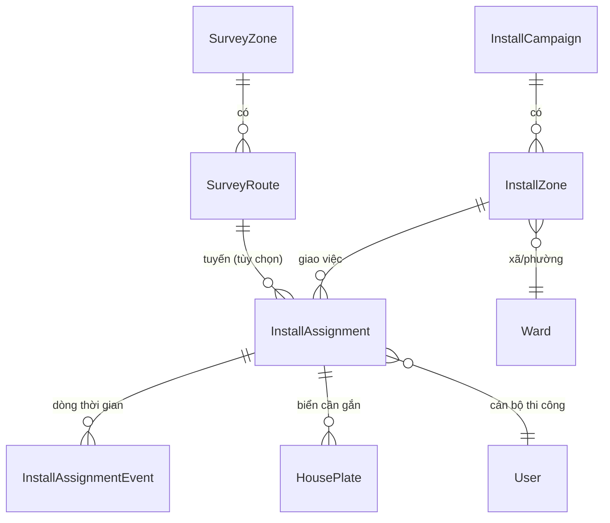
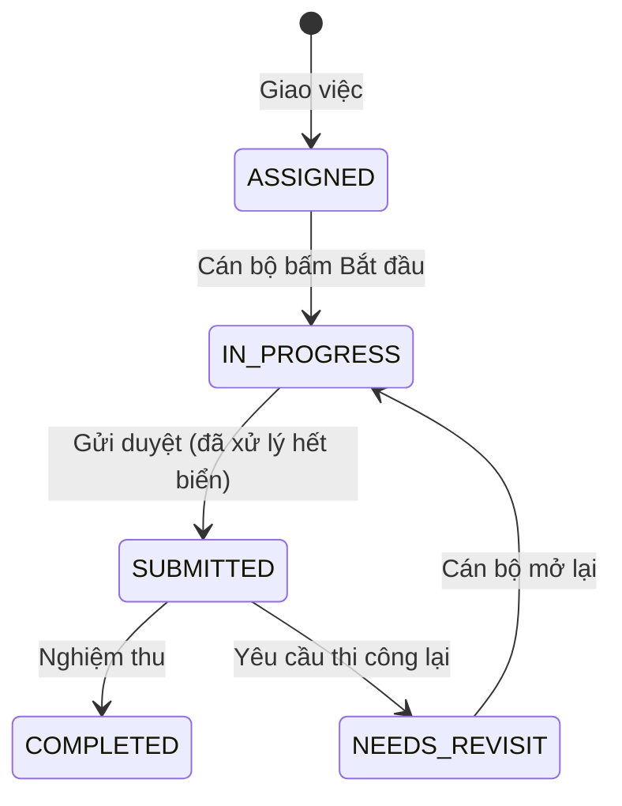

# Kế hoạch phát triển: Nghiệp vụ Thi công — đi gắn biển số nhà

> Tài liệu kế hoạch, **chưa triển khai**. Phân hệ Thi công được thiết kế **tương tự phân hệ Khảo sát** (đợt → phân vùng → tuyến → nhiệm vụ → mobile → nghiệm thu) để tái sử dụng tối đa code và thói quen sử dụng đã có.

## Mục lục
1. [Mục tiêu & phạm vi](#1-mục-tiêu--phạm-vi)
2. [Hiện trạng](#2-hiện-trạng)
3. [Đối chiếu Khảo sát ↔ Thi công](#3-đối-chiếu-khảo-sát--thi-công)
4. [Mô hình dữ liệu](#4-mô-hình-dữ-liệu)
5. [Vòng đời & quy tắc nghiệp vụ](#5-vòng-đời--quy-tắc-nghiệp-vụ)
6. [Phân quyền (RBAC)](#6-phân-quyền-rbac)
7. [API đề xuất](#7-api-đề-xuất)
8. [Web — quản lý thi công](#8-web--quản-lý-thi-công)
9. [Mobile — cán bộ thi công](#9-mobile--cán-bộ-thi-công)
10. [Thông báo & nhắc việc](#10-thông-báo--nhắc-việc)
11. [Báo cáo & Dashboard](#11-báo-cáo--dashboard)
12. [Lộ trình triển khai](#12-lộ-trình-triển-khai)
13. [Rủi ro & điểm cần quyết định](#13-rủi-ro--điểm-cần-quyết-định)
14. [Kiểm thử & nghiệm thu](#14-kiểm-thử--nghiệm-thu)

---

## 1. Mục tiêu & phạm vi

**Mục tiêu:** quản lý việc đi gắn biển số nhà ngoài hiện trường theo **đợt thi công**: chia phân vùng/tuyến, giao việc cho cán bộ thi công, theo dõi tiến độ trên bản đồ, nghiệm thu và xử lý các biển chưa gắn được.

**Trong phạm vi**
- Đợt thi công, phân vùng, tuyến đường, giao nhiệm vụ cho cán bộ thi công.
- Cán bộ thi công làm việc trên mobile: nhận việc, đi gắn, chụp ảnh, ghi nhận chưa gắn được, gửi duyệt.
- Nghiệm thu / yêu cầu thi công lại; thông báo; nhắc việc; báo cáo tiến độ.

**Ngoài phạm vi:** sản xuất/in biển, quản lý vật tư và kho, tối ưu lộ trình di chuyển.

## 2. Hiện trạng

| Nội dung | Hiện có |
|---|---|
| Khảo sát | `SurveyCampaign` → `SurveyZone` (gán xã/phường) → `SurveyRoute` (2 điểm trên bản đồ web, bám đường qua OSRM) → `SurveyAssignment` (giao cán bộ, tùy chọn gắn `routeId`). Vòng đời: ASSIGNED → IN_PROGRESS → SUBMITTED → COMPLETED / NEEDS_REVISIT; dòng thời gian `SurveyAssignmentEvent`; thông báo; nhắc việc; khảo sát lại theo từng nhà. Kéo thả cán bộ vào tuyến, đổi người khi còn ASSIGNED. |
| Biển số | `HousePlate`: ISSUED → INSTALLED / REVOKED. Cấp biển ở web (`plate:issue`). Mobile tab **Biển số** (`PlatesScreen`) xác nhận **đã gắn** có ảnh (`POST /house-plates/:id/install`) hoặc **chưa gắn được** kèm lý do (`/not-installed`). |
| Quyền | `survey:manage`, `assignment:execute`, `assignment:review`; `plate:issue`, `plate:install`, `plate:revoke`. |
| **Thiếu** | Chưa có đợt/nhiệm vụ thi công: cán bộ tự tìm biển chờ gắn, không được giao theo khu vực/tuyến, không có chỉ tiêu, tiến độ, nghiệm thu hay nhắc việc. |

## 3. Đối chiếu Khảo sát ↔ Thi công

| Khái niệm | Khảo sát (đã có) | Thi công (đề xuất) |
|---|---|---|
| Đợt | `SurveyCampaign` | `InstallCampaign` |
| Phân vùng | `SurveyZone` | `InstallZone` |
| Tuyến đường | `SurveyRoute` | **Dùng chung `SurveyRoute`** (xem 4.3) |
| Nhiệm vụ | `SurveyAssignment` | `InstallAssignment` |
| Dòng thời gian | `SurveyAssignmentEvent` | `InstallAssignmentEvent` |
| Đối tượng làm việc | **Nhà** cần khảo sát (`House`) | **Biển** cần gắn (`HousePlate` trạng thái ISSUED) |
| Kết quả hiện trường | Tạo/sửa hồ sơ nhà + ảnh | Gắn biển (ảnh `installPhotoUrl`) hoặc ghi nhận chưa gắn được |
| Chỉ tiêu | `targetCount` (số nhà) | `targetCount` (số biển) |
| Nghiệm thu | `assignment:review` | `install:review` |
| Làm lại | Yêu cầu khảo sát lại từng nhà | Yêu cầu thi công lại từng biển |
| Thông báo | `NotificationEntity.SURVEY_ASSIGNMENT` | `NotificationEntity.INSTALL_ASSIGNMENT` |
| Web | `/houses/surveys` | `/houses/installs` |
| Mobile | Tab Nhiệm vụ + Khảo sát | Tab **Thi công** (hoặc nâng cấp tab Biển số) |

## 4. Mô hình dữ liệu

Nguyên tắc: **chỉ thêm bảng/cột**, migration SQL viết tay, không đổi tên migration đã áp (xem mục 13).

### 4.1. Bảng mới

- **`InstallCampaign`**: `id`, `name`, `description`, `startDate`, `endDate`, `status` (DRAFT / ACTIVE / COMPLETED), `createdById`, mốc thời gian.
- **`InstallZone`**: `campaignId`, `name`, `wardId`, `description`.
- **`InstallAssignment`**:
  - `zoneId`, `routeId?`, `assigneeId`, `dueDate`, `note`, `targetCount?`;
  - `status`: ASSIGNED / IN_PROGRESS / SUBMITTED / COMPLETED / NEEDS_REVISIT;
  - `submittedAt`, `reviewedById`, `reviewedAt`, `reviewNote`, `createdById`.
- **`InstallAssignmentEvent`**: `assignmentId`, `action` (CREATED, STARTED, SUBMITTED, COMPLETED, REVISIT_REQUESTED, REASSIGNED, ISSUE_REPORTED…), `fromStatus`, `toStatus`, `note`, `actorId`, `createdAt`.

### 4.2. Cột thêm vào bảng có sẵn
- `HousePlate.installAssignmentId?` — biển này thuộc nhiệm vụ thi công nào.
- `HousePlate.revisitReason?`, `revisitRequestedAt?` — yêu cầu thi công lại riêng từng biển (tương tự nhà bị yêu cầu khảo sát lại).
- Các cột kết quả hiện trường **đã có**: `installedAt`, `installedById`, `installPhotoUrl`, `notInstalledAt`, `notInstalledReason`.

### 4.3. Tuyến đường: dùng chung hay tách riêng?
| Phương án | Ưu | Nhược |
|---|---|---|
| **A. Dùng chung `SurveyRoute` (khuyến nghị)** | Không phải vẽ lại tuyến; tái dùng `SurveyRoutesPanel`, `RoutePickerMap`, kéo thả cán bộ. | `SurveyRoute` thuộc `SurveyZone` của đợt khảo sát; cần cho phép chọn tuyến của đợt khảo sát khi giao việc thi công. |
| B. Bảng `InstallRoute` riêng | Độc lập hoàn toàn với khảo sát. | Trùng lặp bảng/API/UI; phải vẽ lại tuyến. |

Đề xuất A: `InstallAssignment.routeId` trỏ tới `SurveyRoute`; khi tạo nhiệm vụ chọn đợt khảo sát nguồn (hoặc cho tạo tuyến mới gắn vào một đợt khảo sát bất kỳ). Nếu khách hàng muốn tuyến thi công khác tuyến khảo sát thì chuyển sang B.

### 4.4. Sinh danh sách biển cho một nhiệm vụ
- Khi giao việc (hoặc bấm "Cập nhật danh sách"), hệ thống gom các biển **ISSUED, chưa thuộc nhiệm vụ nào** và:
  - thuộc **xã/phường** của phân vùng; nếu có tuyến thì chỉ lấy biển có nhà **cách tuyến ≤ 100–200 m** (dùng `distanceToPathM` đã có trong `packages/shared`);
  - gán `installAssignmentId`.
- Biển cấp mới sau khi nhiệm vụ đã tạo: hiện gợi ý "có N biển mới trong phạm vi" để người quản lý bổ sung.

## 5. Vòng đời & quy tắc nghiệp vụ

Quy tắc:
1. **Giao việc:** theo phân vùng, tùy chọn gắn 1 tuyến; **mỗi tuyến tối đa 1 nhiệm vụ thi công**; cán bộ phải có quyền `install:execute` và đang hoạt động.
2. **Đổi người:** chỉ khi còn ASSIGNED; ghi dòng thời gian, báo cả người cũ lẫn người mới.
3. **Tự chuyển IN_PROGRESS:** khi cán bộ gắn biển đầu tiên (nếu chưa bấm Bắt đầu).
4. **Gửi duyệt:** chỉ khi mọi biển trong nhiệm vụ đã ở một trong hai trạng thái: *đã gắn* hoặc *chưa gắn được kèm lý do*.
5. **Nghiệm thu:** `COMPLETED`; hoặc `NEEDS_REVISIT` kèm danh sách biển cần làm lại (từng biển có `revisitReason`). Cán bộ chỉ sửa được các biển đang có cờ làm lại.
6. **Biển bị thu hồi/cấp đổi giữa chừng:** biển REVOKED tự rời khỏi nhiệm vụ; biển thay thế (cấp đổi) được tự thêm vào nhiệm vụ của biển cũ.
7. **Xóa:** chỉ xóa nhiệm vụ khi còn ASSIGNED; không xóa phân vùng/tuyến đã có nhiệm vụ.
8. **Luồng hiện tại giữ nguyên:** vẫn gắn được biển không thuộc nhiệm vụ nào (xem điểm quyết định ở mục 13).

## 6. Phân quyền (RBAC)

| Quyền mới | Ý nghĩa | Vai trò mặc định |
|---|---|---|
| `install:manage` | Tạo đợt, phân vùng, giao/đổi việc, xóa | admin, cadastral |
| `install:execute` | Thực hiện nhiệm vụ (bắt đầu, gắn biển, gửi duyệt) | **Cán bộ thi công** (vai trò hệ thống mới), surveyor (nếu khách hàng muốn một người làm cả hai) |
| `install:review` | Nghiệm thu / yêu cầu thi công lại | admin, cadastral |

Lưu ý triển khai quan trọng: quyền và vai trò nằm trong bảng `permission` / `app_role`; trước đây deploy lên server **không có dữ liệu quyền** nên mất menu (xem `FIX_RBAC_SEED_DOCKER.md`). Phân hệ này **phải** đi cùng cơ chế đồng bộ quyền khi API khởi động (`RbacSyncService`) hoặc script SQL tương đương, nếu không quyền mới sẽ không có trên server.

## 7. API đề xuất

| Nhóm | Endpoint | Quyền |
|---|---|---|
| Đợt | `GET/POST /install-campaigns`, `GET/PATCH/DELETE /install-campaigns/:id` | đọc: mọi vai trò; ghi: `install:manage` |
| Phân vùng | `GET/POST /install-zones`, `PATCH/DELETE /install-zones/:id` | `install:manage` |
| Nhiệm vụ | `GET /install-assignments` (`?mine=true`, `?status=`), `GET :id` | đọc: đăng nhập |
| | `POST /install-assignments` (zoneId, routeId?, assigneeId, dueDate, targetCount, note) | `install:manage` |
| | `PATCH :id`, `POST :id/reassign`, `DELETE :id` | `install:manage` |
| | `POST :id/start`, `POST :id/submit`, `POST :id/issues` | `install:execute` (chính chủ) |
| | `POST :id/complete`, `POST :id/request-revisit` | `install:review` |
| | `POST :id/refresh-plates` (cập nhật danh sách biển) | `install:manage` |
| Biển của nhiệm vụ | `GET /install-assignments/:id/plates` | đăng nhập |
| Cán bộ | `GET /install-assignments/installers` (người có `install:execute`) | `install:manage` |

**Tái dùng `house-plates`:** `POST /house-plates/:id/install` và `/not-installed` giữ nguyên; chỉ bổ sung:
- kiểm tra người gọi là chủ nhiệm vụ (khi biển thuộc nhiệm vụ);
- ghi sự kiện vào dòng thời gian nhiệm vụ;
- tự chuyển nhiệm vụ sang IN_PROGRESS (quy tắc 3).

## 8. Web — quản lý thi công

Menu **Thi công** (nhóm *Nghiệp vụ*, hiện theo quyền `install:manage`/`install:review`). Giao diện cùng phong cách Cyber-Tech hiện tại.

- **Danh sách đợt** (`/houses/installs`): lưới card (tên, trạng thái, số phân vùng, người tạo, khoảng ngày, thanh tiến độ theo số biển đã gắn/chỉ tiêu).
- **Chi tiết đợt** (`/houses/installs/[id]`):
  - Thanh thống kê: *Biển cần gắn / Đã gắn / Chưa gắn được*, chiều dài tuyến, số nhiệm vụ.
  - **Bản đồ:** tuyến + **marker biển** màu theo trạng thái (chờ gắn = vàng, đã gắn = xanh, không gắn được = đỏ); bấm marker xem biển/nhà/chủ hộ/ảnh.
  - Panel **cán bộ thi công** kéo thả vào tuyến (tái dùng `SurveyRoutesPanel`, `RoutePickerMap`), kèm thanh tiến độ.
  - Danh sách nhiệm vụ theo phân vùng: trạng thái, hạn, tiến độ, nút *Nhắc việc*, *Duyệt hoàn tất*, *Yêu cầu thi công lại* (chọn từng biển), dòng thời gian.
- Tái dùng: `ui.tsx` (Card, StatusBadge, SegmentedControl, ToggleSwitch, Button), `AssignmentTimeline`, `RemindButton`, `RevisitModal` (bản dành cho biển).

## 9. Mobile — cán bộ thi công

Tab **Thi công** (hoặc nâng cấp tab *Biển số* hiện có):
1. **Danh sách nhiệm vụ** của tôi: phân vùng/tuyến, hạn, tiến độ `đã gắn / chỉ tiêu`, nhãn quá hạn.
2. **Chi tiết nhiệm vụ:** bấm *Bắt đầu*; danh sách biển sắp theo **khoảng cách từ vị trí hiện tại** hoặc theo thứ tự dọc tuyến; lọc *Chờ gắn / Đã gắn / Chưa gắn được*.
3. **Bản đồ nhiệm vụ:** vẽ tuyến + marker biển; nút *Bay tới tuyến*, *Vị trí của tôi*; chỉ đường tới biển bằng Google Maps (đã có mẫu ở màn Bản đồ).
4. **Gắn biển:**
   - chụp ảnh biển sau khi gắn (bắt buộc), tùy chọn ảnh trước;
   - kiểm tra vị trí: nếu đứng cách nhà > 50–100 m thì cảnh báo (cho phép tiếp tục kèm lý do);
   - xác nhận → gọi `POST /house-plates/:id/install`.
5. **Chưa gắn được:** chọn lý do chuẩn hóa (vắng chủ nhà, từ chối, nhà đang xây, địa hình/khó tiếp cận, khác) + ảnh/ghi chú → `/not-installed`.
6. **Gửi duyệt** khi đã xử lý hết biển; xem lý do khi bị **yêu cầu làm lại**, chỉ các biển có cờ làm lại được sửa.
7. **Offline:** hàng đợi thao tác (gắn/chưa gắn + ảnh) lưu cục bộ, tự đồng bộ khi có mạng — theo mẫu `surveyStore` hiện có.

## 10. Thông báo & nhắc việc

- Thêm `NotificationEntity.INSTALL_ASSIGNMENT`; liên kết mở thẳng `/houses/installs/[id]`.
- Sự kiện gửi thông báo: **giao việc**, **đổi người** (cho cả hai bên), **gửi duyệt** (báo người giao), **nghiệm thu/yêu cầu làm lại** (báo cán bộ), **sắp đến hạn / quá hạn**.
- Tái dùng `NotificationsService`, `NotificationBell` (web), màn Thông báo (mobile) và job nhắc việc quá hạn hiện có (mở rộng để quét thêm `InstallAssignment`).

## 11. Báo cáo & Dashboard

- Trang Tổng quan: khối **Tiến độ thi công** — gauge % biển đã gắn, thanh trạng thái nhiệm vụ, top xã/tuyến còn nhiều biển chưa gắn.
- Thống kê theo đợt/xã/tuyến/cán bộ: đã gắn, chưa gắn, lý do chưa gắn (biểu đồ cột).
- **Xuất Excel:** danh sách biển theo nhiệm vụ (số nhà, địa chỉ, chủ hộ, mã biển, trạng thái, ngày gắn, người gắn, lý do chưa gắn, link ảnh).
- API gộp: mở rộng `GET /dashboard/summary` (thêm khối `installs`) hoặc endpoint riêng `GET /dashboard/installs`.

## 12. Lộ trình triển khai

Mỗi giai đoạn build + kiểm thử xong, được duyệt rồi mới sang giai đoạn sau.

| GĐ | Nội dung | Phạm vi chính | Mức độ |
|---|---|---|---|
| **1** | Nền tảng dữ liệu + API + RBAC | Bảng `Install*`, cột `HousePlate`, migration; module `installs` (đợt/phân vùng/nhiệm vụ/dòng thời gian); quyền mới + đồng bộ quyền; sinh danh sách biển cho nhiệm vụ | Lớn |
| **2** | Web quản lý | Menu Thi công, danh sách đợt dạng card, chi tiết đợt, bản đồ tuyến + biển, giao việc kéo thả | Lớn |
| **3** | Mobile thực thi | Tab Thi công, nhận việc, danh sách/bản đồ biển, gắn biển + ảnh + kiểm tra vị trí, chưa gắn được, gửi duyệt | Lớn |
| **4** | Nghiệm thu & vòng làm lại | Duyệt/yêu cầu làm lại từng biển, thông báo, nhắc việc quá hạn | Vừa |
| **5** | Báo cáo & hoàn thiện | Dashboard, Excel, offline queue, tối ưu bản đồ nhiều biển | Vừa |

Tái sử dụng được phần lớn từ Khảo sát nên mỗi giai đoạn có thể bám theo bản tương ứng đã làm (API → web → mobile).

## 13. Rủi ro & điểm cần quyết định

**Cần chốt với khách hàng trước khi làm**
1. Tuyến thi công **dùng chung tuyến khảo sát** (phương án A) hay vẽ riêng (phương án B)?
2. **Ai nghiệm thu** thi công: cán bộ địa chính, quản trị, hay người giao việc?
3. Có bắt buộc **ảnh trước và sau** khi gắn, hay chỉ ảnh sau (như hiện tại)?
4. Có cho phép **gắn biển ngoài nhiệm vụ** (giữ luồng hiện tại) hay bắt buộc phải có nhiệm vụ?
5. Ngưỡng **cảnh báo vị trí** khi gắn biển (50 m? 100 m?) và có chặn hay chỉ cảnh báo.
6. Cán bộ thi công là **vai trò riêng** hay dùng chung với cán bộ khảo sát?
7. Xử lý biển **hỏng/mất sau khi gắn**: tạo nhiệm vụ bảo trì riêng hay cấp đổi như hiện nay?
8. Dữ liệu biển **đã gắn trước đây** (không thuộc đợt nào): giữ nguyên, không gán vào đợt.

**Rủi ro kỹ thuật**
- **Số lượng marker lớn** trên bản đồ: cần gom nhóm (cluster) hoặc chỉ tải biển trong khung nhìn.
- **Ảnh nặng/offline:** nén ảnh phía mobile, hàng đợi có thử lại, tránh mất ảnh khi mất mạng.
- **Dữ liệu tọa độ nhà sai** làm biển nằm ngoài tuyến: cho phép thêm tay vào nhiệm vụ.
- **Triển khai Docker/DB:**
  - Migration chỉ **thêm** bảng/cột; **không đổi tên** migration đã áp (lần trước đổi `0_init` → `00_init` gây lỗi P3009 và HTTP 502).
  - Chạy `prisma migrate deploy` trước khi bật API, và nhớ **đồng bộ quyền/vai trò** (mục 6), nếu không menu và thao tác mới bị ẩn/403.

## 14. Kiểm thử & nghiệm thu

**Kịch bản đầu-cuối**
1. Admin tạo đợt thi công → thêm phân vùng (xã) → chọn tuyến → hệ thống sinh danh sách biển.
2. Kéo thả cán bộ thi công vào tuyến → cán bộ nhận thông báo.
3. Mobile: bắt đầu → đi tới biển → chụp ảnh → xác nhận đã gắn; một biển ghi nhận chưa gắn được kèm lý do → gửi duyệt.
4. Web: nghiệm thu / yêu cầu làm lại một biển → cán bộ thấy cờ làm lại và sửa → nghiệm thu hoàn tất.
5. Dashboard và Excel hiển thị đúng số liệu.

**Kiểm tra phân quyền:** người không có `install:manage` không giao/xóa được; cán bộ chỉ thao tác nhiệm vụ của mình; chỉ người có `install:review` mới nghiệm thu.

**Kiểm tra quy tắc nghiệp vụ:** mỗi tuyến một nhiệm vụ; đổi người chỉ khi ASSIGNED; không gửi duyệt khi còn biển chưa xử lý; biển bị thu hồi rời khỏi nhiệm vụ; xóa phân vùng/tuyến đang có nhiệm vụ bị chặn.

**Kiểm tra kỹ thuật:** `tsc --noEmit` cho api/web/mobile, `next build`, chạy migration trên bản sao DB, thử offline (tắt mạng → gắn biển → bật mạng → đồng bộ), thử với vài nghìn biển để kiểm tra hiệu năng bản đồ.
